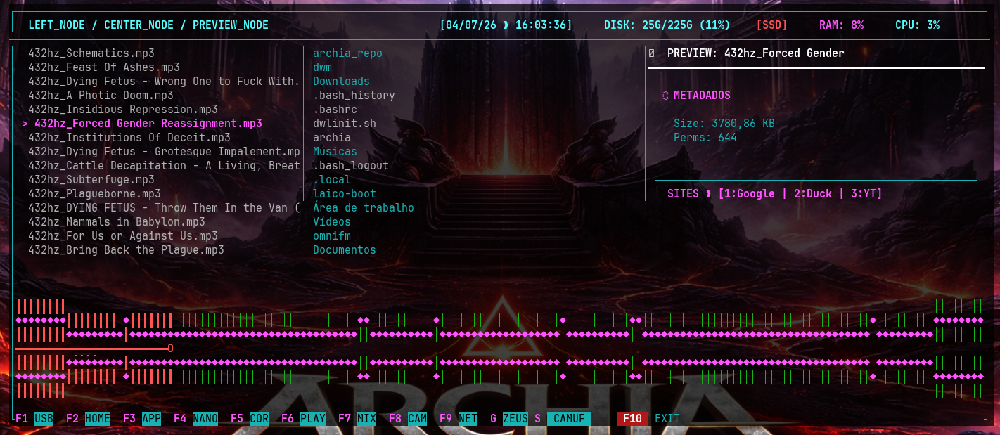
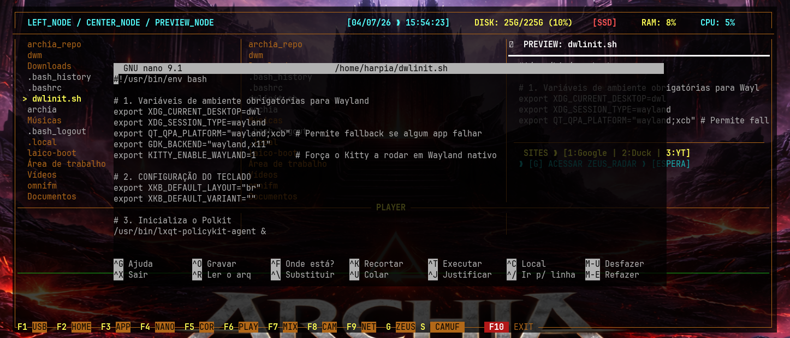
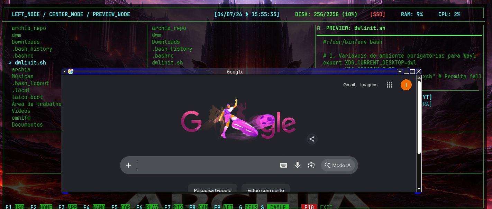
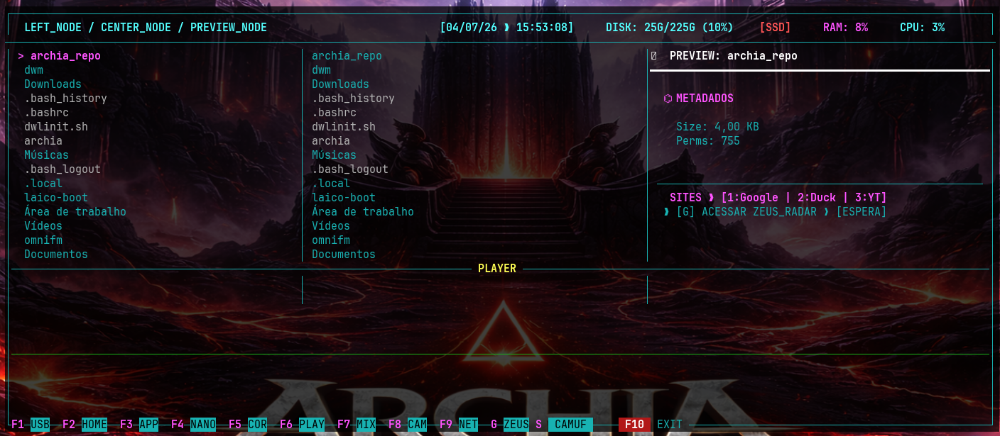
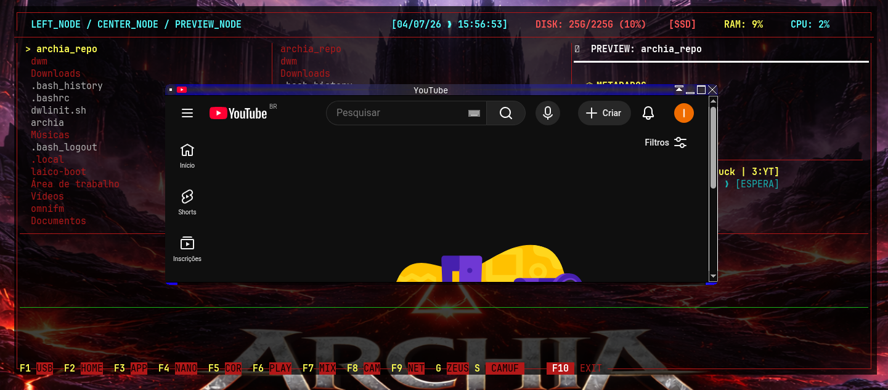

# ⌬ protofull

> **Gerenciador Tático Alpha Node & Central de Comando Archon**
> Um gerenciador de arquivos rápido e lançador de aplicações via TUI baseado em layouts de visualização multi-colunas (*Miller Columns*).

---

## 🛠️ Requisitos de Sistema & Dependências

Para que o **protofull** renderize todas as barras de áudio, ondas, metadados e os snipers táticos perfeitamente, instale o ecossistema completo de dependências:

### 🔳 Interface & Terminal
* **`qterminal`** / **`kitty`** — Emuladores de terminal de alta performance com suporte a fontes Xft.
* **`ncurses`** — Motor gráfico principal para a renderização da TUI.
* **`libx11`** / **`libxft`** — Suporte a renderização nativa de janelas e fontes customizadas.

### 🖼️ Gráficos, Wallpapers & Mídia
* **`sdl2`** / **`sdl2_mixer`** — Motores de áudio utilizados no player e renderização do espectro de onda.
* **`nsxiv`** / **`feh`** — Visualizadores de imagem integrados para pré-visualização rápida de mídias.
* **`swww`** — Gerenciador tático de wallpapers e transições em segundo plano.

### 🔊 Áudio & Sistema
* **`alsa-utils`** — Utilitários de controle e manipulação de canais de áudio via terminal.
* **`mpv`** / **`ffmpeg`** — Decodificadores robustos de vídeo, metadados e streams.

### 🔌 Redes & Armazenamento (USB)
* **`networkmanager`** — Gerenciamento tático de conexões de rede direto pela TUI.
* **`udisks2`** / **`polkit`** — Serviços essenciais para montagem automática e segura de dispositivos USB.

---

## 🚀 Instalação Rápida (Arch Linux)

### Via AUR (Usando yay)
```bash
yay -S protofull-git
```

### Compilação Manual
```bash
# 1. Clone o repositório
git clone https://github.com
cd protofull

# 2. Compile e configure o ambiente
make prepare
make

# 3. Instale o binário no sistema
sudo make install
```

---

## ⌨️ Painel de Controle Operacional (Atalhos)

A barra inferior tática mapeia as principais funções operacionais do sistema através de gatilhos rápidos:


| Tecla | Função Principal | Modo Tático |
| :---: | :--- | :--- |
| **`F1`** | **USB** | Gerenciador e montador de mídias externas (`udisks2`) |
| **`F2`** | **HOME** | Retorna instantaneamente ao diretório raiz do usuário |
| **`F3`** | **APP** | Lançador rápido de aplicações instaladas no sistema |
| **`F4`** | **NANO** | Abre o editor de texto integrado no arquivo selecionado |
| **`F5`** | **COR** | Altera esquemas de cores e temas gerais da interface |
| **`F6`** | **PLAY** | **Controle e customização do tema do espectro de onda** |
| **`F7`** | **MIX** | Abre o console de mixagem e volumes de áudio do sistema |
| **`F8`** | **CAM** | Ativa captura ou gerenciamento de dispositivos de imagem |
| **`F9`** | **NET** | Painel de controle de redes e conexões (`NetworkManager`) |
| **`G`**  | **ZEUS** | Ativa o **Zeus Radar** (Sniper instantâneo de sites) |
| **`S`**  | **CAMUF** | Alterna modos visuais furtivos / ocultação de painéis |
| **`F10`**| **EXIT** | Encerra a execução do Protofull de forma segura |

---
---

## 🔊 Ajuste de Volume Dinâmico

O **protofull** conta com atalhos lineares rápidos para ganho e atenuação de áudio direto na CLI, sem interromper a navegação pelos painéis:

* **`+`** — Incrementa o volume do mixer geral ou player interno.
* **`-`** — Decrementa o volume de forma tática.

---

---

## 🎨 Galeria de Visualização Tática

Confira os modos visuais, player e temas integrados na interface do **protofull**:

### 🎛️ Painel do Player & Ondas Customizadas


### 📝 Integração com Editor Nano


### 🎭 Esquemas de Cores & Temas Operacionais




---
Desenvolvido com orgulho por **Harpiah** 🦅. Licenciado sob a licença MIT.


